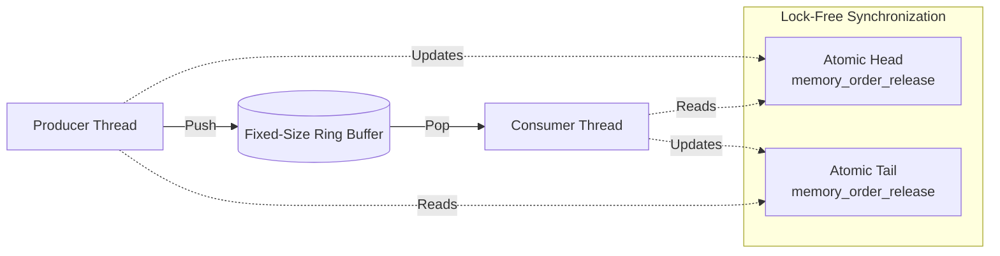

# SPSC Ring Buffer

A high-performance, wait-free Single-Producer Single-Consumer (SPSC) queue for C++11 and above. 

Designed for ultra-low latency applications, this queue bypasses OS-level locks and relies strictly on hardware-level atomics and memory ordering.

## Usage

This library is header-only. Include `spsc_queue.h` and ensure your capacity is a power of 2.

```cpp
#include "spsc_queue.h"
#include <thread>

SPSCQueue<int, 1024> queue;

void producer() {
    for (int i = 0; i < 10000; ++i) {
        while (!queue.push(i)) { /* spin or yield */ }
    }
}

void consumer() {
    int value;
    for (int i = 0; i < 10000; ++i) {
        while (!queue.pop(value)) { /* spin or yield */ }
        // Process value
    }
}
```

## Architecture

The queue utilizes a fixed-size ring buffer with explicit acquire/release memory semantics.



## Technical Implementation Details

1. **Wait-Free Concurrency:** Implemented using `std::atomic` with explicit `std::memory_order_acquire` and `std::memory_order_release` semantics. This prevents instruction reordering while avoiding the performance penalty of sequentially consistent (`seq_cst`) operations.
2. **False Sharing Prevention:** The `head` and `tail` atomic indices are aligned to the system's L1 cache line size using `alignas(std::hardware_destructive_interference_size)`. This guarantees they reside on separate physical cache lines, preventing cache invalidation storms between cores.
3. **Optimized Modulo Arithmetic:** Enforces power-of-2 capacities at compile-time via `static_assert`. This allows the queue to replace expensive hardware division instructions (`%`) with single-cycle bitwise AND `(capacity - 1)` masking for index wrap-around.
4. **Zero-Allocation:** The queue operates on a flat, contiguous array allocated upfront. No heap allocations or deallocations occur during the runtime loop, ensuring deterministic execution times.

## Benchmarks

*Results to be generated using `benchmark/bench_throughput.cpp` and `benchmark/bench_latency.cpp`.*

### Throughput (Operations per Second)
| Implementation | Throughput (M ops/sec) |
|----------------|------------------------|
| SPSC Queue | TBD |
| boost::lockfree::spsc_queue | TBD |
| std::mutex Queue | TBD |

### Latency Percentiles (Microseconds)
| Implementation | p50 | p90 | p99 | p99.9 |
|----------------|-----|-----|-----|-------|
| SPSC Queue | TBD | TBD | TBD | TBD |
| std::mutex Queue | TBD | TBD | TBD | TBD |

## Build Instructions

No external dependencies are required. A standard C++11 compliant compiler is sufficient.

**Run Correctness Tests:**
```bash
g++ tests/test_single_thread.cpp -Iinclude -O3 -o test1 && ./test1
g++ tests/test_multi_thread.cpp -Iinclude -O3 -pthread -o test2 && ./test2
```

**Run Benchmarks:**
```bash
g++ benchmark/bench_throughput.cpp -Iinclude -O3 -pthread -o bench_tp && ./bench_tp
g++ benchmark/bench_latency.cpp -Iinclude -O3 -pthread -o bench_lat && ./bench_lat
```
