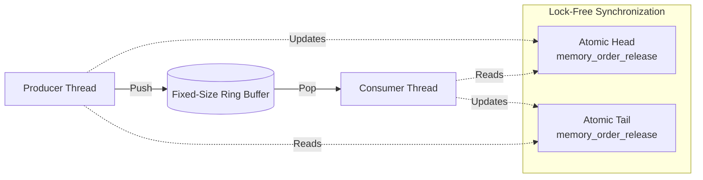
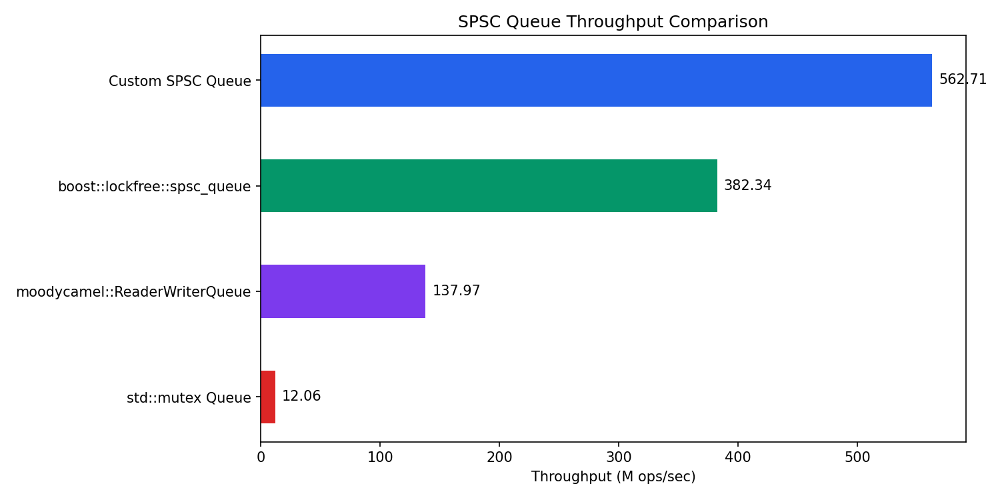
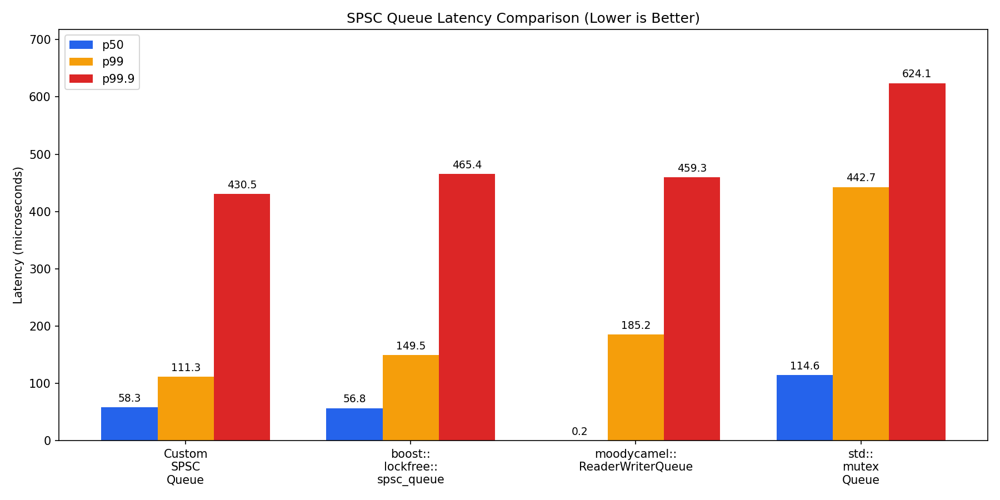

# SPSC Ring Buffer

A high-performance, wait-free Single-Producer Single-Consumer (SPSC) queue for C++17 and above.

Designed for ultra-low latency applications, this queue bypasses OS-level locks and relies strictly on hardware-level atomics and memory ordering.

## Usage

This library is header-only. Include `spsc_queue.h` and ensure your capacity is a power of 2.

```cpp
#include "spsc_queue.h"
#include <thread>

SPSCQueue<int, 1024> queue;

void producer() {
    for (int i = 0; i < 10000; ++i) {
        while (!queue.push(i)) { /* spin or yield */ }
    }
}

void consumer() {
    int value;
    for (int i = 0; i < 10000; ++i) {
        while (!queue.pop(value)) { /* spin or yield */ }
        // Process value
    }
}
```

## Architecture

The queue utilizes a fixed-size ring buffer with explicit acquire/release memory semantics.



## Technical Implementation Details

1. **Wait-Free Concurrency:** Implemented using `std::atomic` with explicit `std::memory_order_acquire` and `std::memory_order_release` semantics. This prevents instruction reordering while avoiding the performance penalty of sequentially consistent (`seq_cst`) operations.
2. **False Sharing Prevention:** The `head` and `tail` atomic indices are aligned to the system's L1 cache line size using `alignas(std::hardware_destructive_interference_size)`. This guarantees they reside on separate physical cache lines, preventing cache invalidation storms between cores.
3. **Cached Remote Indices:** Each side caches the other's index locally. The producer caches `tail` and only re-reads it (cross-core fetch) when the cached value indicates the queue appears full. Same for the consumer caching `head`. This avoids unnecessary cache coherence traffic on the fast path.
4. **Optimized Modulo Arithmetic:** Enforces power-of-2 capacities at compile-time via `static_assert`. This allows the queue to replace expensive hardware division instructions (`%`) with single-cycle bitwise AND `(capacity - 1)` masking for index wrap-around.
5. **Zero-Allocation:** The queue operates on a flat, contiguous array allocated upfront. No heap allocations or deallocations occur during the runtime loop, ensuring deterministic execution times.

## Benchmarks

### Methodology

- **Rounds:** Each benchmark runs 10 measured rounds; results report the **median** across rounds.
- **Warmup:** A warmup pass is executed before measurement to eliminate cold-start bias (TLB, branch predictor, page faults).
- **CPU Pinning:** Producer and consumer threads are pinned to dedicated physical cores via `pthread_setaffinity_np` to prevent OS-induced thread migration.
- **Spin Backoff:** `_mm_pause()` is used in spin loops to reduce memory bus contention.

### Competitors

| Implementation | Architecture | Source |
|---|---|---|
| `Custom SPSC Queue` | Bounded (1024), Zero-allocation | This repository |
| `boost::lockfree::spsc_queue` | Bounded (1024), Zero-allocation | Boost C++ Libraries |
| `moodycamel::ReaderWriterQueue` | Unbounded, Dynamic Block Allocation | [cameron314/readerwriterqueue](https://github.com/cameron314/readerwriterqueue) |
| `std::mutex` Queue | Bounded (1024), Lock-based | Baseline |


### Throughput (M ops/sec)

| Implementation | Throughput (Median) |
|---|---|
| Custom SPSC Queue | 562.71 |
| boost::lockfree::spsc_queue | 382.34 |
| moodycamel::ReaderWriterQueue | 137.97 |
| std::mutex Queue | 12.06 |



### Latency Percentiles (microseconds)

| Implementation | p50 | p99 | p99.9 |
|---|---|---|---|
| Custom SPSC Queue | 58.3 | 111.3 | 430.5 |
| boost::lockfree::spsc_queue | 56.8 | 149.5 | 465.4 |
| moodycamel::ReaderWriterQueue | 0.2 | 185.2 | 459.3 |
| std::mutex Queue | 114.6 | 442.7 | 624.1 |



> Results will vary by platform. Numbers above are from the environment listed below.

### Environment

| | |
|---|---|
| CPU | - |
| Cores | - |
| Compiler | g++ 13.3.0 |
| OS | Ubuntu 24.04 (WSL2) |
| Boost | 1.83.0 |

## Build Instructions

Requires a C++17 compiler, CMake 3.16+, and Boost headers.

```bash
# Build
mkdir build && cd build
cmake ..
make

# Run tests
./test_single
./test_multi

# Run benchmarks
./bench_throughput
./bench_latency
```

### Generate Charts

Requires Python 3 with `matplotlib`.

```bash
./build/bench_throughput | python3 benchmark/plot_results.py throughput
./build/bench_latency   | python3 benchmark/plot_results.py latency
```

Charts are saved to `benchmark/results/`.

### Hardware Counter Analysis (Linux)

```bash
cd benchmark
chmod +x run_perf.sh
./run_perf.sh ../build/bench_throughput
```
